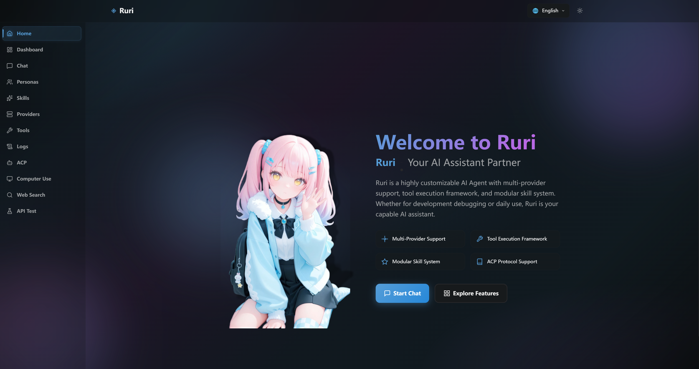

<div align="center">
    <h1>Ruri 琉璃</h1>
    <p><b>A customizable AI Agent, written in Rust + Vue.</b></p>
    <p><a href="README.md">English</a> | <a href="README.zh-CN.md">中文</a></p>
</div>

> [!WARNING]
> This project is under construction, it cannot be used in production for now.

## Features

- [x] Model Provider - Anthropic, OpenAI, LM Studio, Custom
- [x] Tool Call
- [x] Skills
- [x] Web Search
- [x] ACP (Agent Client Protocol) Server
- [x] Persona
- [x] MCP (Model Context Protocol) Client
- [x] Command System
- [x] RAG-Based Knowledge Base (Embedding Model + Rerank Model) support
- [x] Chat - DingTalk
- [x] Chat - Discord
- [ ] Chat - OneBot V11
- [x] Chat - Personal WeChat(Wechat ClawBot)

### Planned in the future

- More Providers
- Sub Agent
- Chat - Matrix
- Chat - VoceChat
- Chat - QQ
- Chat - WeCom
- Chat - Custom API(You can write your own program to talk to Ruri)

...

## Usage

Documentation will be added soon...

## Dev

```bash
cargo run
```

Open the web UI at `http://localhost:3000`.

### ACP (Agent Client Protocol) Server Config

Config example in Zed:

```json
{
  "agent_servers": {
    "ruri": {
      "type": "custom",
      "command": "/<path_to>/ruri",
      "args": ["--acp"]
    }
  }
}
```

## Preview



## License

[MIT License](./LICENSE) © 2026-PRESENT Vincent-the-gamer
