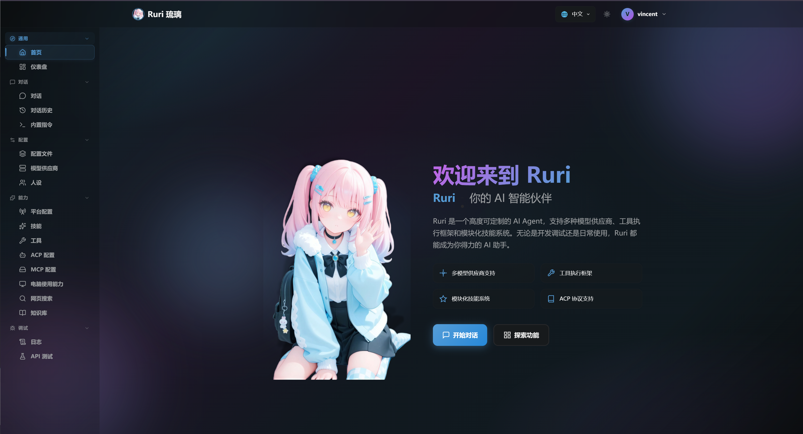

<div align="center">
    
    <h1>Ruri 琉璃</h1>
    <p><b>一个可自定义的 AI 智能体，使用 Rust + Vue 编写。</b></p>
    <p><a href="README.md">English</a> | <a href="README.zh-CN.md">中文</a></p>
</div>

> [!IMPORTANT]
> 本项目已进入内测阶段。

## 特性

- [x] 模型提供商 - Anthropic兼容, OpenAI兼容, Gemini API, 自定义
- [x] 工具调用
- [x] 技能
- [x] 网页搜索
- [x] ACP (Agent Client Protocol) 服务端
- [x] 人格系统
- [x] MCP (Model Context Protocol) 客户端
- [x] 指令系统
- [x] 基于RAG的知识库 (嵌入模型 + 重排序模型) 支持
- [x] 聊天平台 - 钉钉
- [x] 聊天平台 - Discord
- [x] 聊天平台 - 个人微信(微信ClawBot插件)
- [x] 沙盒 - AIO Sandbox (https://github.com/agent-infra/sandbox)
- [x] 聊天记录 - 对话管理与筛选搜索
- [x] 聊天平台 - OneBot V12（一个自定义聊天机器人标准）

### 未来计划

- Sub Agent
- 聊天平台 - Matrix
- 聊天平台 - VoceChat
- 聊天平台 - QQ
- 聊天平台 - WeCom
- 聊天平台 - Custom API(You can write your own program to talk to Ruri)

...

## 安装和运行

1. 从Release下载内测版: [GitHub Releases](https://github.com/Vincent-the-gamer/ruri/releases)
2. 添加进环境变量(PATH)
3. 运行 `ruri`

```bash
# 查看帮助
ruri -h

# 默认端口： 3000
ruri
# 指定端口
ruri --port 8080
# 远程访问，将端口暴露在局域网
ruri --remote
```

## 使用

文档：https://ruri.vince-g.xyz/

## 开发

```bash
cargo run
```

在 `http://localhost:3000` 打开 Web UI。

### ACP (Agent Client Protocol，Agent客户端协议) 服务端配置

Zed配置范例:

```json
{
  "agent_servers": {
    "ruri": {
      "type": "custom",
      "command": "/<path_to>/ruri",
      "args": ["--acp"]
    }
  }
}
```

## 预览



## 开源许可证

[GPLv3 License](./COPYING)

版权所有 (C) 2026-现在 Vincent-the-gamer <https://github.com/Vincent-the-gamer>
